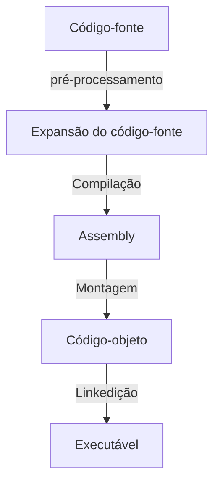

# Compilação (Parte 1: pré-compilação)

Continuaremos com um programa bastante simples. Mas agora, faremos pequenas alterações para que ele execute uma soma e imprima algumas informações. Parece um passo pequeno demais, mas na verade, estamos correndo em ritmo acelerado pois vamos estudar diversos conceitos de computação neste artigo.

Estes conceitos não estão relacionados ao domínio da sintaxe em C, ou boas práticas. Mas compreender este conteúdo fará de você um programador mais consciente e capaz de tomar decisões visando a eficiência do código.

O diagrama seguinte fará parte da nossa jornada nessa e nas próximas etapas. Você se familiarizará com ele muito em breve.



## Arquitetura e organização de computadores

Não nos aprofundaremos nestes temas, pois estas são disciplinas inteiras de qualquer curso de Engenharia/Ciência da Computação. Mas iremos abordar alguns assuntos relacionados. Se quiser se aprofundar em como um computador realmente funciona, pegue um bom livro e/ou bons vídeos sobre o tema. Sempre que um conceito de computação for mencionado, marcarei com uma tag [AOC], indicando que é um conceito de arquitetura e organização de computadores e indicando artigos sobre o assunto e palavras-chaves para pesquisas mais aprofundadas.

## A estrutura do código

Nossa estrutura permanece quase igual, nosso arquivo de código tem apenas algumas linhas a mais. Chamaremos o arquivo de códico em linguágem C de **código-fonte**.

### Código-fonte

O código-fonte deste programa tem poucas alterações em relação ao código da etapa anterior.

Entre as diferenças, aparecem:
```
5   int a, b;
13  int c = 0;
```

Isto é a declaração de variáveis. Nossas variáveis a, b e c são do tipo inteiro. Em C, precisamos declarar as variáveis antes de podermos acessá-las. Outra característica do C é que precisamos especificar o tipo da variável na declaração. Isso porque o C é uma linguagem do tipo declarativa. O Python, por exemplo, não necessita de declaração de variáveis, ainda que, em alguns casos, seja recomendável inicilizar uma variável, o que parece muito com uma declaração, mas não é. Em C, a declaração não é uma recomendação opicional, é obrigatório!

O conceito de variável aqui não é o mesmo da matemática. **Uma variável é uma posição nomeada de memória que é usada para guardar um valor que pode ser modificado pelo programa.** De forma simples é um espaço reservado da memória para uso do programa ao qual damos um **identificador** (um nome).


### Memória

Podemos classificar a memória de um computador de várias formas. Um computador, no rigor da teoria, é composto por três elemantos: um processador, a memória e um barramento de entrada e saída. Falaremos destes conceitos apenas de forma superficial [AOC].

No sentido estrito, a memória do computador é a RAM, chamada de memória volátil. Na arquitetura dos computadores pessoais, a RAM contem dados e instruções. Em outros dispositivos, instruções e dados podem ficar separados.

[AOC: Arquitetura de programa armazenado, modelo de Von Neumann](https://pt.wikipedia.org/wiki/Arquitetura_de_von_Neumann).

[AOC: Arquitetura Harvard](https://pt.wikipedia.org/wiki/Arquitetura_Harvard)

No sentido amplo, o armazenamento pode ser considerado um tipo de memória. Porém é mais lento e está separado do processador pelo barramento de entrada e saída, enquanto a RAM possui um barramento exclusivo.

Com o surgimento das memórias de estado sólido (SSD) e os barramentos NVME, a diferença de velocidade caiu drásticamente. Mas estando em um meio de comunicação compartilhado com todos os periféricos, o SSD ainda pode ficar esperando que o barramento esteja desocupado para que ele possa enviar ou receber dados. Se a RAM estivesse no barramento de E/S, nosso computador travaria constantemente, já que a execução de qualquer programa depende do acesso à ela.
[EAC, Hierarquia de memória](https://pt.wikipedia.org/wiki/Hierarquia_da_mem%C3%B3ria)

Para nós, memória sempre será no sentido estrito, isto é, a RAM. Enquando os SSDs, HDs, pendrives e CD-ROMs serão chamados de armazenamento.

Um programa compilado é armazenado no disco rígido de um computador. Este disco pode ser local (um hd interno) ou remoto (um site, um disco de rede). Quando executamos um programa, ele precisa ser copiado do armazenamento para a memória. O Sistema Operacional (SO) é responsável por fazer isso, bem como por garantir que haja um espaço dedicado para o programa na memória, isso chamamos de alocação de memória. Ao final da execução, o espaço ocupado precisa ser desalocado.

### Alocação de memória

Como dito antes, uma variável é um pedaço nomeado da memória. Nesta sessão, veremos uma abordagem mais técnica deste processo:

Ao iniciar o programa, o SO reserva um espaço para o programa na memória. Este espaço é dividido em quatro partes:
- Região reservada para o programa
- Região reservada para variáveis globais
- Pilha ou stack, região com diversos usos durante a execução (ex. variáveis locais)
- Heap, região livre acessivel ao programa para alocação dinâmica de memória

Quando declaramos uma variável do tipo inteiro, por exemplo, o compilador consulta o tamanho de um inteiro em bytes afim de fazer a reserva na porção de memória adequada. O tamanho pode variar de sitema para sistema, conforme a arquitetura. Por isso, o compilador precisa saber em que tipo de máquina o programa será executado.

No GCC, poderíamos indicar que estamos compilando um código para o microcontrolador Atmega 328p do Arduíno, para o microcontrolador PIC 16F, para um microprocessador ARM de celular, ou ainda, para um microprocessador Intel ou AMD. Na verdade, há variações até mesmo entre gerações diferentes da Intel, por exemplo.

Por padrão, no Linux, o GCC consulta os cabeçalhos do SO e determina a versão correta para aquele sistema. Você nem precisa ficar sabendo deste processo.

Pois bem, ao declarar a variável inteira, o que irá acontecer é que o SO irá reservar 2 bytes (ou 4, a depender do sistema) para aquela variável. Simples assim!

Neste caso, estamos usando a **"alocação estática de memória"**. Isto é, no começo da execução, o SO precisa saber exatamente o tamanho do espaço a ser alocado, por isso informamos o tipo (e por consequência o tamanho) de cada variável antes de usá-las. Portanto, as variáveis no C não podem mudar de tipo no meio do programa, e em consequencia disso, também não podem mudar de tamanho. Um int será sempre um int.

Há também a alocação dinâmica, que utiliza o heap como espaço. Falaremos dos vários tipos e de alocação dinâmica em outro momento.

### O algoritmo de main.c

Havendo declarado a e b, computaremos a soma deles, salvando em c, uma variável. E, em seguida, imprimiremos algumas informações.

O algoritmo é simples. Mas, há muita coisa acontencendo aqui.

Primeiramente, declaramos as variáveis. O SO irá fazer a alocação do espaço adequado para cada variável declarada, isso garante alguma memória para que o programa execute e impede que outros programas acessem dados do nosso programa. Há ataques hackers baseados nisso e os sistemas operacionais modernos tentam impedir que isso ocorra. a e b referem-se à um espaço alocado na região de variáveis globais. Já c, refere-se a um espaço alocado na pilha.

Para nós, programadores (chamados de usuários em alguns casos), a memória alocada é uma grade matriz. O SO disponibiliza um bloco de memória com endereços contíguos. Cada byte, possui um endereço e cada endereço aponta para um byte. É isso que o programador C enxerga e entende.

Mas para o processador, isso faz pouco sentido. Para ele, não há funções, nem variáveis, nem tipos. Há apenas a memória. Todo o resto é abstração do sistema operacional ou da linguagem, por meio do compilador.

Portanto, nosso código precisa ser compilado para que esse punhado de funções com o nível de abstração mediana do C  se transforme nas instruções básicas de baixo nível executadas por um processador.

### Pré-compilação

O processo de compilação, como dito anteriormente, consiste no uso de um conjunto de ferramentas que trasnformam código-fonte (texto codificado em caracteres ASCII) em código-de-máquina (binário executável). O GCC cuida de todas as etapas para nós, escondendo o processo.

Mas na verdade, compilar é mais do que apenas executar um comando do gcc.

A primeira coisa que o gcc faz é chamar um programa chamado cpp, isto é, C pre-processor. Falamos brevemente do pré-processador quando explicamos a instrução define.

O que o pré-processador faz pode ser chamado de expansão do código-fonte. Um programa em C desconhece a função printf() que imprime na tela. De onde vêm essa informação? Um bom chute é que venha da biblioteca de entrada e saída padrão: a stdio.h. Se você pensou nisso, acertou!

Um spoiler: Não são apenas as variáveis que precisam ser declaradas. Funções também! Da mesma forma, seus identificadores apontam para uma região da memória onde seu código estará armazenado. A função printf e tantas outras estão declaradas na lib-stdio e prontas para uso.

O pré-processador pega todo conteúdo dessa biblioteca e acrecenta em um arquivo de texto contendo o código-fonte intermediário. É isso que será compilado.

### Na prática

Você pode ignorar o GCC e chamar o CPP por conta própria para ver o que ele faz.

```
$ cpp main.c > main.i
```

O operador ">" no terminal do Linux redireciona a saída do comando à esquerda. Portanto, a saída do CPP ao invés de ser exibida na tela, será gravada no arquivo main.i.

Se quiser exibir o conteúdo do arquivo, você pode executar o comando: ```cat main.i```. Ou para poupar tempo, você pode imprimir no arquivo e na tela ao mesmo tempo usando o operador "|" (pipe) e o comando *tee*

```
$ cpp main.c | tee main.i
```

Observe a saída e veja o tanto de código que o cpp adicionou ao seu código-fonte. Nosso código encontra-se no final do código expandido. Observe a expansão do define. O que um define faz é substituir no código-fonte aquele rótulo pelo valor definido a ele, como o comando buscar e substituir do Word ou do Visual Studio Code. Veja com é um comportamento diferente do que aconteceu com as variáveis.

## Conclusão

Vimos vários conceitos sobre a memória de um computador. Sabemos que é o Sistema Operacional que gerencia a memória, alocando e desalocando espaço para a execução dos programas. Nós interferimos nesse processo declarando as variáveis com tipos diferentes, cada tipo com seu tamanho e uso, que pode ser diferente para cada sistema. Esse é o papel do compilador.

Vimos também que o processador, desconhece o conceito de variáveis e tipos, para ele, há apenas memória e endereços de memória. Alguns conceitos de arquitetura e organização foram abordados superficialmente e alguns artigos sobre o assunto foram recomendados. Tire um tempo para lê-los

Por fim, vimos que o primeiro passo da compilação é, na verdade , outro processo chamado de pré-compilação, que expande nosso código-fonte através das diretrizes de pré-compilação como o define e o include.